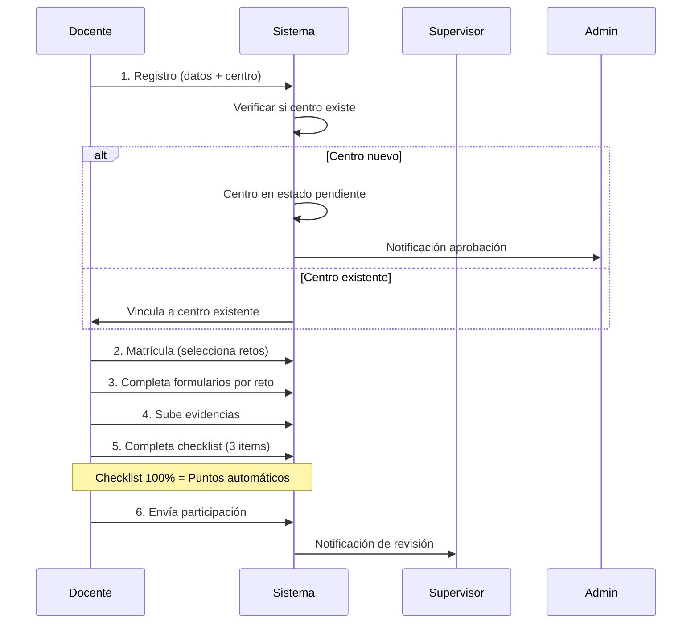
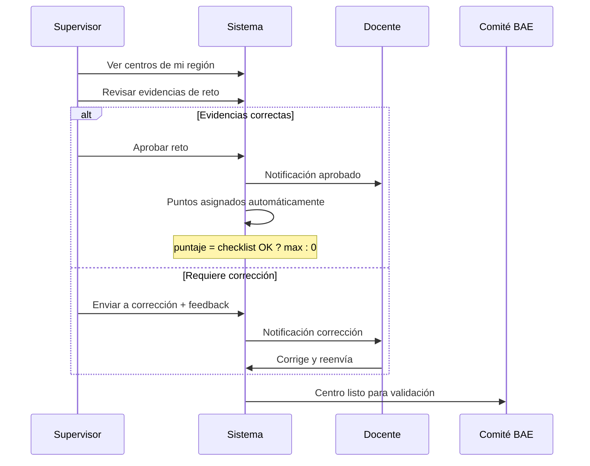

# Guardianes Formularios

Plugin de WordPress para el programa **Bandera Azul Ecológica** (BAE) de Costa Rica. Gestiona la participación de centros educativos en eco-retos ambientales, incluyendo matrícula, evidencias, evaluaciones y certificación.


## 📋 Tabla de Contenidos

1. [Resumen](#resumen)
2. [Requisitos](#requisitos)
3. [Instalación](#instalación)
4. [Roles de Usuario](#roles-de-usuario)
5. [Flujos de Usuario](#flujos-de-usuario)
6. [Paneles/Dashboards](#panelesdashboards)
7. [Arquitectura Técnica](#arquitectura-técnica)
8. [Shortcodes](#shortcodes)
9. [Hooks y Filtros](#hooks-y-filtros)
10. [Configuración](#configuración)
11. [Changelog](#changelog)

---

## Resumen

El plugin **Guardianes Formularios** facilita la participación de centros educativos en el programa Bandera Azul Ecológica. Los docentes registran sus centros, seleccionan eco-retos, suben evidencias, y reciben evaluación por supervisores regionales y el Comité BAE.

### Características Principales

- 🏫 **Gestión de Centros Educativos**: Registro con autocompletado desde base MEP
- 🎯 **Eco-Retos Personalizables**: CPT con formularios WPForms asociados
- 📝 **Wizard de Matrícula**: Flujo guiado para selección de retos
- 📸 **Sistema de Evidencias**: Carga de archivos con validación EXIF
- ✅ **Checklist de Cumplimiento**: 3 requisitos obligatorios por reto
- ⭐ **Sistema de Puntajes**: Automático basado en cumplimiento de checklist
- 🔔 **Notificaciones**: Sistema interno de alertas
- 📊 **Reportes y Exportación CSV**: Por región, reto o global

---

## Requisitos

| Componente  | Versión Mínima       |
| ----------- | -------------------- |
| WordPress   | 6.0+                 |
| PHP         | 7.4+                 |
| MySQL       | 5.7+ / MariaDB 10.3+ |
| ACF Pro     | 6.0+                 |
| WPForms Pro | 1.8+                 |

### Plugins Requeridos

1. **Advanced Custom Fields PRO** - Campos personalizados
2. **WPForms Pro** - Formularios de matrícula y retos

---

## Instalación

1. **Subir el plugin**

   ```bash
   # Copiar carpeta a wp-content/plugins/
   cp -r guardianes-formularios/ /path/to/wp-content/plugins/
   ```

2. **Activar el plugin**

   - Ve a WordPress Admin → Plugins
   - Busca "Guardianes Formularios"
   - Haz clic en "Activar"

3. **Configurar ACF**

   - El plugin registra automáticamente los campos ACF
   - Verifica en ACF → Grupos de Campos

4. **Crear páginas con shortcodes**

   ```
   /panel-docente     → [gn_docente_panel]
   /panel-supervisor  → [gn_supervisor_panel]
   /panel-admin       → [gn_admin_panel]
   /panel-comite      → [gn_comite_panel]
   ```

5. **Importar Centros MEP (opcional)**
   ```bash
   # Colocar CSV en seeders/escuelas-mep.csv
   # Ejecutar vía WP-CLI o navegador
   wp eval-file wp-content/plugins/guardianes-formularios/seeders/seed-centros-mep.php
   ```

---

## Roles de Usuario

### 👨‍🏫 Docente (`docente`)

Profesor encargado de registrar y gestionar la participación del centro educativo.

**Capacidades:**

- `gnf_submit_entries` - Enviar evidencias
- `gnf_view_own_centro` - Ver su centro

**Estados:**

- `pendiente` - Esperando aprobación
- `activo` - Cuenta activa
- `rechazado` - Solicitud rechazada

### 🔍 Supervisor (`supervisor`)

Revisor regional que evalúa las evidencias de los centros en su región.

**Capacidades:**

- `gnf_review_entries` - Revisar evidencias
- `gnf_approve_entries` - Aprobar retos
- `gnf_view_region` - Ver centros de su región

**Estados:**

- `pendiente` - Esperando aprobación de admin
- `activo` - Cuenta activa

### 🏛️ Comité BAE (`comite_bae`)

Autoridad superior que valida centros después de la aprobación regional.

**Capacidades:**

- `gnf_view_all_regions` - Ver todas las regiones
- `gnf_validate_entries` - Validación final

**Restricciones:**

- ❌ NO puede asignar puntos manualmente

### 👤 Administrador

Gestión completa del sistema.

**Capacidades adicionales:**

- `manage_guardianes` - Acceso completo al plugin
- Aprobar/rechazar usuarios
- Gestionar configuración

---

## Flujos de Usuario

### Flujo Docente



### Flujo Supervisor



### Estados de un Reto

```
no_iniciado → en_progreso → completo → enviado → aprobado
                              ↓
                          correccion → enviado
```

| Estado        | Descripción                        |
| ------------- | ---------------------------------- |
| `no_iniciado` | Reto matriculado sin actividad     |
| `en_progreso` | Formulario parcialmente completado |
| `completo`    | Checklist 100%, listo para enviar  |
| `enviado`     | Esperando revisión del supervisor  |
| `aprobado`    | Revisado y aprobado                |
| `correccion`  | Devuelto para correcciones         |

---

## Paneles/Dashboards

### Panel Docente `[gn_docente_panel]`

**Pestañas:**

- **Resumen**: Vista general de progreso y puntos
- **Formularios**: Wizard paso a paso para completar retos
- **Matrícula**: Editar selección de retos

**Características:**

- Selector de año
- Progreso visual por reto
- Checklist detallado
- Botón "Enviar Participación" (cuando todo está completo)
- Tutoriales de ayuda

### Panel Supervisor `[gn_supervisor_panel]`

**Características:**

- Lista de centros de su región
- Estadísticas: pendientes, aprobados, corrección
- Filtros por estado
- Exportación CSV
- Vista detalle por centro

### Panel Admin `[gn_admin_panel]`

**Secciones:**

- **Inicio**: Dashboard con estadísticas y actividad reciente
- **Usuarios**: Aprobar docentes y supervisores pendientes
- **Centros**: Gestión de centros educativos
- **Retos**: Estadísticas por eco-reto
- **Reportes**: Top centros, resumen por región
- **Configuración**: Enlaces a configuración WP

### Panel Comité `[gn_comite_panel]`

**Características:**

- Vista de TODAS las regiones
- Historial de validaciones
- Filtros por región y estado
- Validación final de centros
- Exportación de datos

---

## Arquitectura Técnica

### Custom Post Types

| CPT              | Slug               | Descripción                       |
| ---------------- | ------------------ | --------------------------------- |
| Centro Educativo | `centro_educativo` | Escuelas y colegios participantes |
| Reto             | `reto`             | Eco-retos disponibles             |

### Taxonomías

| Taxonomía          | Slug        | Asociado a         |
| ------------------ | ----------- | ------------------ |
| Dirección Regional | `gn_region` | `centro_educativo` |

### Tablas Personalizadas

```sql
-- Entries de retos (progreso por centro/reto/año)
wp_gn_reto_entries
  - id, centro_id, reto_id, user_id, anio
  - estado, puntaje, checklist, evidencias
  - supervisor_id, feedback, created_at, updated_at

-- Notificaciones internas
wp_gn_notificaciones
  - id, user_id, tipo, mensaje, ref_type, ref_id
  - leido, created_at

-- Matrículas por año
wp_gn_matriculas
  - id, centro_id, anio, retos_ids, meta_estrellas
  - created_at, updated_at
```

### Campos ACF Principales

**Centro Educativo:**

- `codigo_mep` - Código MEP (opcional)
- `region` - Dirección Regional (taxonomy)
- `circuito` - Circuito educativo
- `provincia`, `canton`, `distrito`, `poblado`
- `dependencia`, `zona`
- `telefono`, `telefono2`
- `puntaje_total`, `estrella_final`

**Reto:**

- `formulario_wpforms_id` - ID del formulario WPForms
- `puntaje_maximo` - Puntos máximos del reto
- `checklist` - Items obligatorios (debe tener 3)
- `color_del_reto` - Color para UI
- `icono_estatico`, `icono_animado` - Iconos
- `archivo_pdf` - Guía del reto

---

## Shortcodes

| Shortcode                  | Descripción                              | Roles        |
| -------------------------- | ---------------------------------------- | ------------ |
| `[gn_docente_panel]`       | Panel completo del docente               | docente      |
| `[gn_supervisor_panel]`    | Panel de revisión regional               | supervisor   |
| `[gn_admin_panel]`         | Dashboard administrativo                 | admin        |
| `[gn_comite_panel]`        | Panel del Comité BAE                     | comite_bae   |
| `[gn_wizard]`              | Wizard de formularios (redirect a panel) | docente      |
| `[gn_registro_supervisor]` | Formulario registro supervisor           | público      |
| `[gn_notificaciones]`      | Lista de notificaciones                  | autenticados |
| `[mock_docente]`           | Vista demo panel docente                 | desarrollo   |
| `[mock_supervisor]`        | Vista demo panel supervisor              | desarrollo   |

---

## Hooks y Filtros

### Actions

```php
// Después de aprobar un reto
do_action('gnf_entry_approved', $entry_id, $centro_id, $reto_id);

// Después de enviar a corrección
do_action('gnf_entry_correction', $entry_id, $feedback);

// Al completar matrícula
do_action('gnf_matricula_completed', $centro_id, $anio, $retos_ids);
```

### Filters

```php
// Modificar puntaje calculado
add_filter('gnf_calculated_score', function($puntaje, $entry) {
    return $puntaje;
}, 10, 2);

// Años disponibles para selección
add_filter('gnf_available_years', function($years) {
    return $years;
});

// Campos del centro en búsqueda AJAX
add_filter('gnf_centro_search_fields', function($fields) {
    return $fields;
});
```

---

## Configuración

### Opciones del Plugin

Accede desde **WordPress Admin → Guardianes → Configuración** o usa `gnf_get_option()`:

| Opción                    | Tipo  | Descripción                    |
| ------------------------- | ----- | ------------------------------ |
| `anio_actual`             | int   | Año activo del programa        |
| `matricula_frontend`      | bool  | Flujo nativo activo (sin WPForms para matrícula) |
| `rango_estrellas`         | array | Rangos de puntaje por estrella |
| `videos_tutoriales`       | array | URLs de tutoriales YouTube     |

### Configurar WPForms

1. Crea formularios para:

   - Matrícula nativa (selección de retos)
   - Cada eco-reto (evidencias + checklist)

2. Asocia el formulario al CPT Reto:

   - Edita el Reto
   - Campo "Formulario WPForms ID" → selecciona el form

3. Mapeo de campos automático:
   - El plugin intercepta `wpforms_process_complete`
   - Guarda datos en `wp_gn_reto_entries`

---

## Changelog

### v1.2.0 (2024-12)

**Nuevas Características:**

- ✨ Panel Admin frontend (`[gn_admin_panel]`)
- ✨ Panel Comité BAE (`[gn_comite_panel]`)
- ✨ Sistema de diseño "Nature Theme" con CSS variables
- ✨ Autocompletado AJAX para búsqueda de centros
- ✨ Importador de centros MEP desde CSV
- ✨ Registro de supervisores con flujo de aprobación
- ✨ Enlace "Olvidé mi contraseña" en login

**Mejoras:**

- 🎨 Dashboards con diseño nature-inspired (Ocean Blue + Forest Green)
- 📊 Estadísticas en tiempo real en todos los paneles
- 🔍 Filtros avanzados por región, estado, año
- 📱 Diseño responsive mejorado

**Correcciones:**

- 🐛 Puntajes: 0 puntos si checklist incompleto (antes daba 50%)
- 🐛 Supervisores NO pueden asignar puntos manualmente
- 🐛 Comité BAE puede ver todas las regiones

### v1.1.0 (2024-11)

- ✨ Wizard de matrícula integrado en panel docente
- ✨ Estados de reto: no_iniciado → en_progreso → completo → enviado → aprobado
- ✨ Checklist detallado con vista de pendientes
- 🎨 Integración del wizard como pestañas

### v1.0.0 (2024-10)

- 🎉 Lanzamiento inicial
- CPTs: Centro Educativo, Reto
- Roles: Docente, Supervisor
- Paneles: Docente, Supervisor
- Integración WPForms
- Sistema de puntajes y estrellas

---

## Soporte

**Desarrollado para:** Movimiento Guardianes de la Naturaleza  
**Programa:** Bandera Azul Ecológica - Categoría Centros Educativos  
**País:** Costa Rica 🇨🇷

Para soporte técnico, contacta al equipo de desarrollo.

---

## Licencia

GPL v2 o posterior. Compatible con WordPress.
